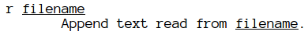

# The r and w Commands #

If you read `info sed 'Sed Programs'` (online
[here](https://www.gnu.org/software/sed/manual/sed.html#sed-Programs)),
you'll find this on the second paragraph (at least in GNU Sed info page):

> Commands within a _script_ or _script-file_ can be separated by semicolons
> (;) or newlines (ASCII 10). Some commands, due to their syntax, cannot be
> followed by semicolons working as command separators and thus should be
> terminated with newlines or be placed at the end of a _script_ or
> _script-file_. Commands can also be preceded with optional non-significant
> whitespace characters.

Let us confirm the first sentence, summarized as “commands can be separated by
semicolons or newlines.” Suppose we want to enclose single digit numbers in
parenthesis, two-digit numbers in square brackets, and three or more digit
numbers in curly braces. That is, 9 would become (9), 99 would become [99]
and 999 or 9999 would become {999} or {9999}. We will use three sed commands to
achieve that.

This is our sample `nums.txt` input file:

    foo 7 bar
    foo 81 bar
    foo 934 bar
    foo 1001 bar

And this is the Sed script using semicolons to separate the different sed
substitution commands.

    sed 's/\b[0-9]\b/(&)/; s/\b[0-9]\{2\}\b/[&]/; s/\b[0-9]\{3,\}\b/{&}/' < nums.txt

And the result is:

    foo (7) bar
    foo [81] bar
    foo {934} bar
    foo {1001} bar

Note that we also made good use of the “commands can also be preceded with
optional non-significant whitespace characters” feature and we intentionally
added a whitespace after each semicolon and the next `s` command to improve
readability of where each `s` command starts.

Although the info page doesn't mention it explicitly, the last
command of a _sed script_ doesn't need to be followed by a semicolon (or a
newline for that matter), although there are exceptions, as we'll soon see
(when there is a filename just before the closing “`}`” command or semicolon
command separator).

Let's see the version of the script that uses newlines instead of semicolon to
separate commands. This is the case where newlines make more sense than
semicolons because we can have each sed command on its own line, making the
script easier to read and understand. Create a file named `program.sed` and
type this:

    #!/usr/bin/sed -f

    s/\b[0-9]\b/(&)/
    s/\b[0-9]\{2\}\b/[&]/
    s/\b[0-9]\{3,\}\b/{&}/

Make it executable:

    chmod u+x program.sed

and run it:

    ./program.sed < nums.txt

The _newlines_ on the script are simply the line breaks we get when we hit
&lt;Enter&gt; on the keyboard to start a new line of text. Just as a tip, on
Vim, one can type:

    :set listchars=eol:$
    :set list

to see where newlines appear in a file (they will be marked by the “$”
character, and by the way, “eol” stands for “end of line”). To disable
it just do:

    :set nolist

It is also possible to have the newlines literally on the command line as
well. The shell will understand that you did not finish typing the Sed
command until it sees the closing single quote:

    $ sed 's/\b[0-9]\b/(&)/
    > s/\b[0-9]\{2\}\b/[&]/
    > s/\b[0-9]\{3,\}\b/{&}/' < nums.txt
    foo (7) bar
    foo [81] bar
    foo {934} bar
    foo {1001} bar

Now, we turn our attention to the next sentence in `info sed 'Sed Programs'`:
“Some commands, due to their syntax, cannot be followed by semicolons working
as command separators and thus should be terminated with newlines or be placed
at the end of a _script_ or _script-file_.” One would hope that at least
somewhere else in the info page, it would mentioned what commands cannot be
followed by semicolons. I could find nothing about that. But empirical
observation proved that at least the `w` and `r` commands can be added to that
category.

To illustrate this case, we are going to take a situation where we want to
include the contents of `footer.html` to the end of `about.html`.

Our first attempt works just fine:

    sed '$ r footer.html' < about.html

We used the `$` address so that we insert the footer only after the last line
of `about.html`. Had we omitted the address, we would add the footer over and
over again for every line of `about.html`.

This Sed program works as expected, and we did just what the info page says,
that is, we we placed the `r` command at the end of the script (although it
is the only command we have anyway).

Now, suppose that the last line of `about.html` contains the HTML comment:

    <!-- Insert the footer here -->

And we want to insert the footer, but also **remove** that HTML comment. Let
us try it:

    $ sed '$ r footer.html; /<!--.*-->/ d' < about.html 
    <!DOCTYPE html>
    <html>
      <head>
        <meta charset='utf-8'>
        <title>Title</title>
      </head>
    <body>
      <h1>Title</h1>
      
A sample paragraph!

      <!-- Insert the footer here. -->

What happened was that the neither was the footer inserted, nor was the comment
removed.

Let's read the man:

Not much of a help to figure out what the problem is. Let's try the info page:

    info sed 'Other Commands'

and scroll down to the `r` command.

    `r FILENAME'
       As a GNU extension, this command accepts two addresses.

       Queue the contents of FILENAME to be read and inserted into the
       output stream at the end of the current cycle, or when the next
       input line is read.  Note that if FILENAME cannot be read, it is
       treated as if it were an empty file, without any error indication.
       ...

Aha! If the filename can't be read, Sed pretends it read an empty file and
no error is shown!

If we look back at our command:

    sed '$ r footer.html; /<!--.*-->/ d' < about.html

`footer.html` was spelled correctly. The problem in this case is that Sed
thinks that both the semicolon and the space following it are part of the
filename. Our footer file certainly isn't called ‘`footer.html; `’, but Sed
doesn't warn us that such file does not exist.

We have some options. One of them is to use multiple `-e` expressions. Another
one is to remember that the info page said that “some commands cannot be
terminated by semicolons and should be terminated by newlines,” or we can
simulate newlines using the shell's special quoting mechanism.

Using multiple `-e` expressions:

    sed -e '$ r footer.html' -e '/<!--.*-->/ d' < about.html

Using multiple expressions even works if we wanted, for some reason, to group
the `r footer.html` command inside curly braces:

    $ sed '$ {r footer.html}; /<!--.*-->/ d' < about.html
    sed: -e expression #1, char 0: unmatched `{'

Sed thinks that “`}`” is part of the filename, and consequently fails to find
the closing curly brace to match the opening one. But since we can use multiple
`-e`s and technically `{` and `}` are commands, this works properly:

    sed -e '$ {r footer.html' -e '}; /<!--.*-->/ d' < about.html

The option using literal newlines inside a script:

    #!/usr/bin/sed -f

    $ r footer.html
    /<!--.*-->/ d

And then, we can use the shell's special quoting mechanism to make it (the
shell) convert sequences like `\n` or `\t` and pass it as literal newlines
or tab characters to Sed. Some shells that support this feature are Bash,
Zsh and Ksh.

    sed $'$ r footer.html\n /<!--.*-->/ d' < about.html

The last option has to do with the fact that Sed doesn't understand ASCII or
C-like escape sequences like '\t', the exception of `\n` that “matches the
newline character.” It _matches_, but does not insert or represent one.

Also, pay attention to the fact that the `$` outside the quotes is what triggers
the shell's special quoting mechanism, and it has nothing to do with the `$`
character right after the opening single quote, which is the Sed address that
represents the last line of the file.

In bash, read more about `$''` quoting style by typing `man bash` and then
search for `QUOTING` (type `/` followed by `QUOTING` and then hit Enter).

